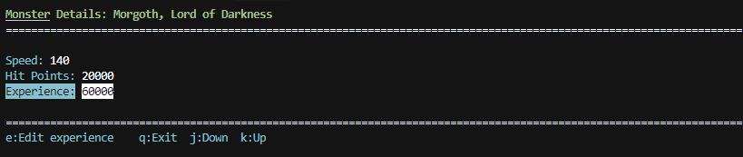

# Monster File Editor (MFE) for Angband - Group 18

This directory contains a Python-based monster browser for Angband that can be used as a standalone tool or integrated into the main Angband game.

## Files

- `edit_monsters.py`: The main Python script that displays the monster browser
- `run_monster_editor.sh`: Shell file for starting the edit monsters script but can also start with 
- `monster_screen.c`: C interface to integrate the browser with Angband
- `monster_screen.h`: Header file for the C interface
- `ui-game.c`: edited ui command Angband file for integrating ^M command for running the editor in game

Time spent:
Programming python curses pages and functionality: 7 hours
Writing test cases: 1 hour
Testing app and making changes to code: 2 hours

## Running as a Standalone Tool

You can run the monster browser as a standalone tool within the angband folder using:

```bash
 python3 src/MFE/edit_monsters.py
```

## Requirements

- Python 3.6 or higher
- Curses library for Python (usually included with Python)

## Notes

- The monster browser reads data directly from the `lib/gamedata/monster.txt` file
- The browser displays monster names in a list and shows detailed information when a monster is selected 
# Monster File Editor (MFE) for Angband - Group 18

This directory contains a Python-based monster browser for Angband that can be used as a standalone tool or integrated into the main Angband game.

## Files

- `show_monsters.py`: The main Python script that displays the monster browser
- `monster_screen.c`: C interface to integrate the browser with Angband
- `monster_screen.h`: Header file for the C interface

Time spent:
Programming python curses pages: 4 hours (Connor)


## Running as a Standalone Tool

You can run the monster browser as a standalone tool using:

```bash
python3 show_monsters.py
```

3. Add the monster_screen.c file to the build system:

   - For Makefile-based builds, add `monster_screen.o` to the OBJECTS list in `Makefile.src`
   - For CMake-based builds, add `src/MFE/monster_screen.c` to the source files list in `CMakeLists.txt`

4. Make sure Python 3 is installed on the system where Angband will run

## Requirements

- Python 3.6 or higher
- Curses library for Python (usually included with Python)

## Notes

- The monster browser reads data directly from the `lib/gamedata/monster.txt` file
- If the curses interface fails, it will fall back to a simpler text-based interface
- The browser displays monster names in a list and shows detailed information when a monster is selected 

